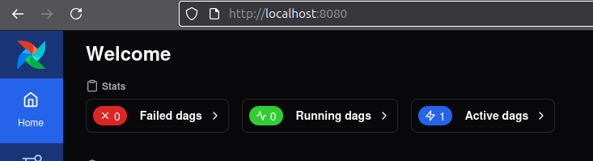
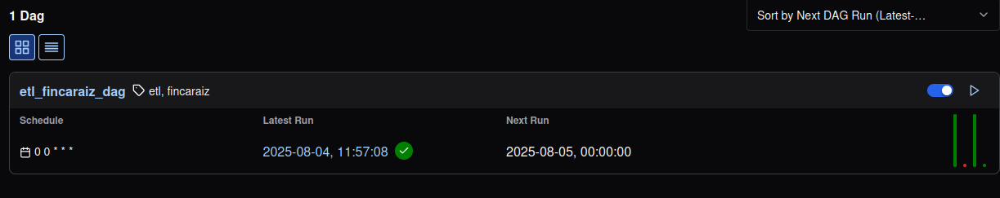
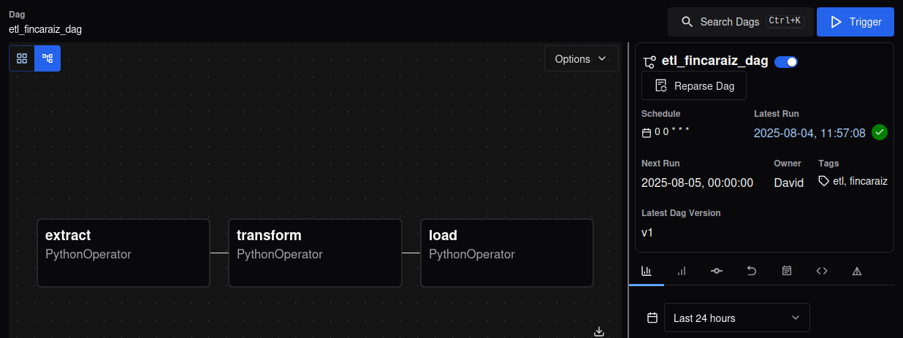
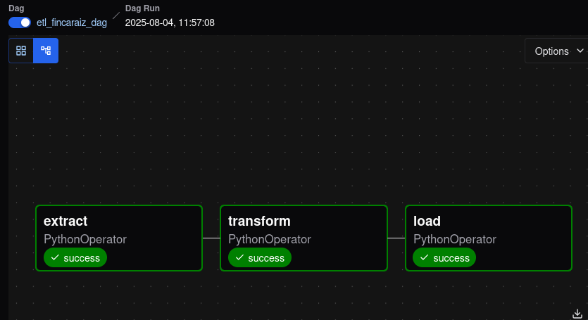

# 🏡 ETL de Propiedades con Apache Airflow + PostgreSQL – Scraping de FincaRaíz

Este proyecto implementa un pipeline de **Extracción, Transformación y Carga (ETL)** de datos inmobiliarios desde el portal [FincaRaíz](https://www.fincaraiz.com.co), usando **Apache Airflow** como orquestador, **Selenium** como scraper y **PostgreSQL** como motor de base de datos.

> 💡 Proyecto parte del portafolio de **Data Engineering** de [David Bojacá](https://github.com/dsbojaca)


## ⚙️ Tecnologías Utilizadas

- 🐍 Python 3.10+
- 🔄 Apache Airflow 3.0.3 (modo `standalone`)
- 🐘 PostgreSQL (motor relacional local)
- 🌐 Selenium WebDriver (Firefox headless)
- 📊 Pandas
- 🐚 Bash / CLI


## 🗂️ Estructura del Proyecto

```
app/
├── dags/
│   └── etl_fincaraiz_dag.py  
├── etl/
│   ├── extract.py            
│   ├── transform.py         
│   └── load.py         
├── utils/
│   └── driver.py       
├── requirements.txt        
├── .env.example          
└── README.md
```

## 🚀 Descripción del Pipeline

1. **🔍 Extract – `extract.py`**
   - Usa Selenium para navegar dinámicamente por [FincaRaíz](https://www.fincaraiz.com.co) y obtener propiedades.
   - Exporta los resultados en formato `DataFrame`.

2. **🧹 Transform – `transform.py`**
   - Limpia, normaliza y filtra los datos.
   - Elimina duplicados y nulos.

3. **📥 Load – `load.py`**
   - Inserta el DataFrame final en una tabla de PostgreSQL.
   - Crea la tabla si no existe.
 - ⚠️ El archivo load.py usará las variables de entorno:
   ```bash
    DB_HOST=localhost
    DB_PORT=5432
    DB_NAME=fincaraiz
    DB_USER=postgres
    DB_PASSWORD=tu_password  #contraseña personal
    ```

4. **🌀 Orquestación – `etl_fincaraiz_dag.py`**
   - Define el flujo `extract → transform → load` en un DAG Airflow programado manualmente o por cron.
  


## 🐘 Configuración de PostgreSQL

Asegúrate de tener corriendo un servidor PostgreSQL local con una base de datos válida:

```bash
# Crear base de datos (si no existe)
createdb fincaraiz

# Conectarte para verificar
psql -d fincaraiz -U postgres
```


## 🌀 Uso de Apache Airflow (standalone)

Este proyecto usa Airflow en modo standalone, ideal para entornos de desarrollo.

### 🟢 Iniciar Airflow:
```bash
# Activar entorno virtual
source env/bin/activate

# Iniciar Airflow en modo standalone
airflow standalone

```

### Esto inicializa:
- Scheduler
- Web UI en http://localhost:8080
- Base de datos SQLite (por defecto)

## 🔐 Login en Airflow

Airflow crea un usuario automáticamente al iniciar `standalone`. Revisa en consola algo como:

```bash
Username: admin
Password: XXXXX
```
### 💡 Opcion alternativa:
en la terminal de comandos
```bash
# Activar entorno virtual
source env/bin/activate

# Ver las credenciales generadas por el airflow standalone 
cat ~/airflow/simple_auth_manager_passwords.json.generated

```
despues ingresar al Web UI en http://localhost:8080 e ingresar las credenciales aqui:


## 🔁 Ejecución del DAG manual

Una vez iniciado Airflow:

### ⚠️ El archivo por defecto tiene estipulada una ejecucion diaria, simplemente es por temas de practicidad y pruebas


- Busca el DAG en  **`Active dags`**



- accede a  **`etl_fincaraiz_dag`**



- Haz clic en **`Trigger`**



Se empezara a ejecutar y al finalizar deberias ver cada una de las task asi:




## 🚀 Futuro del Proyecto

Este proyecto representa una implementación inicial de un pipeline **ETL** automatizado con **Airflow** y **PostgreSQL**, centrado en el scraping de datos inmobiliarios desde FincaRaíz.  

🎯 **Objetivo a largo plazo:**  
Ampliar este pipeline como parte de una aplicación más robusta para análisis del mercado en Colombia, incorporando visualizaciones, análisis de tendencias y alertas inteligentes para usuarios interesados en compra de productos apartir de un presupuesto determinado.


## 🙌 Agradecimientos

Gracias por revisar este proyecto.  
Es solo el comienzo de una idea que busca escalar hacia una solución real con impacto en el análisis de datos del sector economico .

